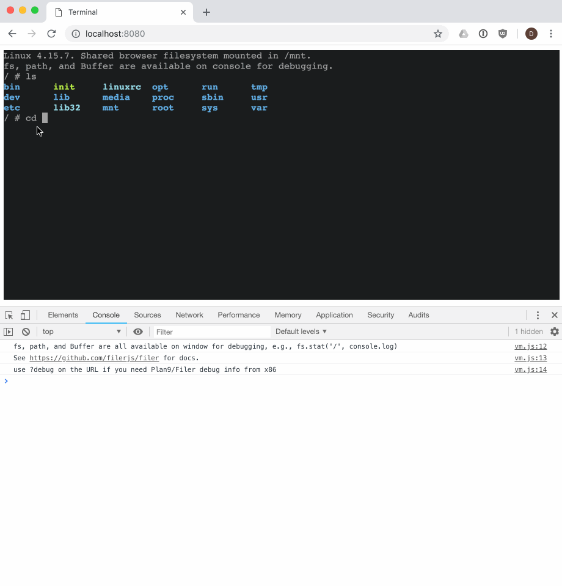

# browser-shell

A [Linux shell](https://github.com/humphd/browser-vm) in the browser via
[forked v86](https://github.com/humphd/v86/tree/filer-9p-lastknowngood),
with bi-directional POSIX filesystem (via [Filer](https://github.com/filerjs/filer))
shared over [Plan 9 resource sharing](https://www.kernel.org/doc/Documentation/filesystems/9p.txt).

The Filer filesystem in the browser is mounted in the Linux VM at `/mnt`.

## Demo

You can play with the [online demo](https://humphd.github.io/browser-shell/), or
watch a [screencast on YouTube](https://youtu.be/TFxpPbNDlJw).

The first time you boot, it needs to download the ISO, and do a cold boot. After
that it will cache the state of the VM in Cache Storage, and reboots will be
nearly instant (like resuming your laptop form sleep).

The shared filesystem's root dir (`/`) is mounted in `/mnt` in the Linux VM.
You can open the console and get access to `fs`, `path`, and `Buffer` if you want
to try doing things from JS with the filesystem; just remember that your files
are rooted in `/` vs. `/mnt` in JS.

Below, I demonstrate creating some files and directories from
Linux, then accessing them via JS and the console, and vice versa.  Pretty much
anything that Linux can do with a filesystem should work, including working with
files, directories, symlinks, and all the usual I/O commands.  File a bug if you find
something that doesn't work.

